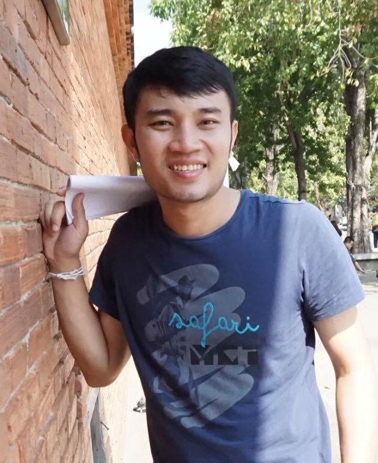

## Biography

Vatsanai is a Ph.D student at bio-inspired robotics and neural engineering laboratory (BRAIN Lab), school of Information Science and Technology (IST), Vidyasirimedhi Institute of Science and Technology (VISTEC), Thailand. He recieved his B.Eng degree in instrumentation engineering with second class honors from the King Mongkut's Institute of Technology Ladkrabang, Thailand in 2015. 

 

 
  
   
   
## Research Interests

 
  
   
   
## Publications

